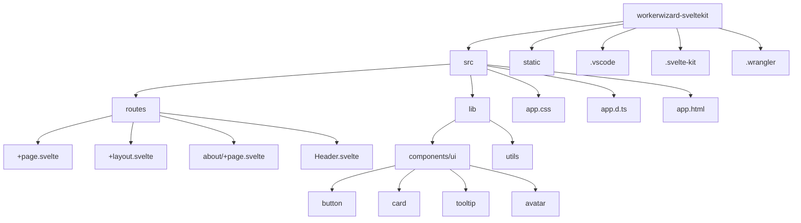

# WorkerWizard - SvelteKit on Cloudflare Workers

A streamlined solution for deploying SvelteKit applications to Cloudflare Workers.

[](https://sveltekit.workerwizard.com)
[](https://github.com/CLQuantizer/workerwizard-sveltekit)

## Features

- 🚀 Fast Deployment
- ⚡ Edge Computing
- 🔧 Easy Setup
- 🌍 Global Distribution
- 📚 Comprehensive Documentation

## Project Structure



## Getting Started

### Prerequisites

- Node.js 18+
- npm or pnpm
- Cloudflare account

### Installation

1. Clone the repository:
```bash
git clone https://github.com/CLQuantizer/workerwizard-sveltekit.git
cd workerwizard-sveltekit
```

2. Install dependencies:
```bash
npm install
```

3. Configure your environment:
```bash
cp .env.example .env
# Edit .env with your Cloudflare credentials
```

### Development

Start the development server:
```bash
npm run dev
```

### Deployment

Deploy to Cloudflare Workers:
```bash
npm run deploy
```

## Tech Stack

- [SvelteKit](https://kit.svelte.dev/) - Web framework
- [TypeScript](https://www.typescriptlang.org/) - Type safety
- [Tailwind CSS](https://tailwindcss.com/) - Styling
- [shadcn-svelte](https://www.shadcn-svelte.com/) - UI components
- [Cloudflare Workers](https://workers.cloudflare.com/) - Edge computing

## Contributing

Contributions are welcome! Please feel free to submit a Pull Request.

## License

This project is licensed under the MIT License - see the [LICENSE](LICENSE) file for details.
